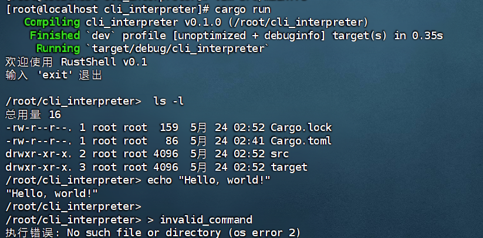

### 1. 创建 Rust 项目
首先，确保你已经安装了 Rust 和 Cargo。然后创建一个新的 Rust 项目：
```bash
cargo new cli_interpreter
cd cli_interpreter
```

### 2. 编写代码
在 `src/main.rs` 文件中编写代码。以下是一个简单的命令行解释器的实现：

#### 基础版本（支持命令解析和错误处理）
```rust
use std::io::{self, Write};
use std::process::{Command, Stdio};
use std::path::Path;
use std::env;

fn main() {
    println!("欢迎使用 RustShell v0.1");
    println!("输入 'exit' 退出\n");
    
    loop {
        print_prompt();
        
        let input = match read_input() {
            Ok(input) => input,
            Err(e) => {
                eprintln!("读取输入错误: {}", e);
                continue;
            }
        };
        
        if input.trim() == "exit" {
            break;
        }
        
        if let Err(e) = execute_command(&input) {
            eprintln!("执行错误: {}", e);
        }
    }
    
    println!("再见!");
}

fn print_prompt() {
    let current_dir = env::current_dir().unwrap_or_default();
    print!("{}> ", current_dir.display());
    io::stdout().flush().expect("刷新stdout失败");
}

fn read_input() -> io::Result<String> {
    let mut input = String::new();
    io::stdin().read_line(&mut input)?;
    Ok(input)
}

fn execute_command(input: &str) -> io::Result<()> {
    let parts: Vec<&str> = input.trim().split_whitespace().collect();
    if parts.is_empty() {
        return Ok(());
    }
    
    let command = parts[0];
    let args = &parts[1..];
    
    match command {
        "cd" => {
            if args.is_empty() {
                let home = env::var("HOME").unwrap_or_else(|_| "/".to_string());
                env::set_current_dir(Path::new(&home))?;
            } else {
                env::set_current_dir(Path::new(args[0]))?;
            }
            Ok(())
        }
        _ => {
            let mut child = Command::new(command)
                .args(args)
                .stdin(Stdio::inherit())
                .stdout(Stdio::inherit())
                .stderr(Stdio::inherit())
                .spawn()?;
            
            child.wait()?;
            Ok(())
        }
    }
}
```

### 3. 编译和运行
在项目目录下运行以下命令来编译和运行你的命令行解释器：
```bash
cargo run
```

### 4. 测试功能
- **基础命令执行**：
  ```
  > ls -l
  ```
- **命令参数解析**：
  ```
  > echo "Hello, world!"
  ```
- **错误处理**：
  ```
  > invalid_command
  ```

### 5. 测试结果

