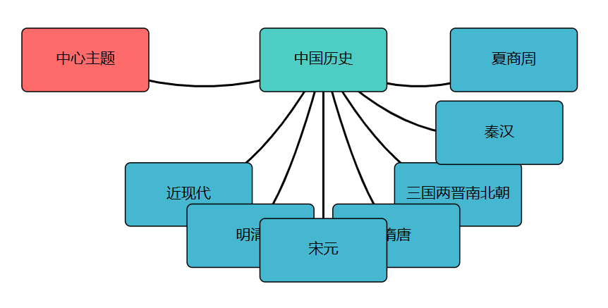

# 思维导图生成器 - 大作业报告

软件2306 朱星瑶 20232241167

## 一、项目概述
本项目是基于Rust实现的**命令行交互式思维导图工具**，主要功能包括：
- 节点增删改查
- 可视化布局算法
- SVG格式导出
- DOT格式导出

## 二、功能特性

### 核心功能
- **节点管理**
  - 创建中心节点（初始化）
  - 添加子节点（带文本内容）
  - 移动节点位置（XY坐标调整）

### 可视化输出
- **DOT格式导出**（Graphviz兼容格式）
- **SVG图像生成**（带自动布局）
  - 矩形节点框
  - 连线关系
  - 文本居中显示

### 交互式CLI
- 支持命令：
  ```
  add <父节点ID> <文本内容>
  move <节点ID> <X偏移> <Y偏移>
  list        # 显示所有节点
  dot         # 导出DOT格式
  svg         # 保存SVG文件
  quit        # 退出程序
  ```

## 三、技术实现

### 完整代码
```rust
use std::collections::HashMap;
use std::f32::consts::PI;
use std::fs::File;
use std::io::{self, Write};
use petgraph::graph::{Graph, NodeIndex};
use petgraph::dot::{Dot, Config};
use petgraph::visit::EdgeRef;

const HORIZONTAL_SPACING: f32 = 150.0;
const VERTICAL_SPACING: f32 = 100.0;
const NODE_WIDTH: f32 = 120.0;
const NODE_HEIGHT: f32 = 60.0;

#[derive(Debug, Clone)]
struct MindNode {
    id: usize,
    text: String,
    x: f32,
    y: f32,
    children: Vec<usize>,
    level: usize,
}

struct MindMap {
    nodes: HashMap<usize, MindNode>,
    next_id: usize,
    graph: Graph<String, ()>,
    node_indices: HashMap<usize, NodeIndex>,
}

impl MindMap {
    fn new(root_text: &str) -> Self {
        let mut graph = Graph::new();
        let root_index = graph.add_node(root_text.to_string());
        
        let mut node_indices = HashMap::new();
        node_indices.insert(0, root_index);
        
        let mut nodes = HashMap::new();
        nodes.insert(0, MindNode {
            id: 0,
            text: root_text.to_string(),
            x: 0.0,
            y: 0.0,
            children: Vec::new(),
            level: 0,
        });
        
        Self {
            nodes,
            next_id: 1,
            graph,
            node_indices,
        }
    }

    fn calculate_angle(&self, parent_id: usize, level: usize) -> f32 {
        let parent = &self.nodes[&parent_id];
        let sibling_count = parent.children.len() as f32;
        
        match level {
            1 => 2.0 * PI * sibling_count / 8.0,
            2 => 2.0 * PI * sibling_count / 16.0,
            _ => 2.0 * PI * sibling_count / 24.0,
        }
    }

    fn add_node(&mut self, parent_id: usize, text: &str) -> Option<usize> {
        if !self.nodes.contains_key(&parent_id) {
            return None;
        }

        let parent = self.nodes.get(&parent_id)?;
        let level = parent.level + 1;
        let angle = self.calculate_angle(parent_id, level);
        let distance = match level {
            1 => HORIZONTAL_SPACING * 1.5,
            2 => HORIZONTAL_SPACING * 1.2,
            _ => HORIZONTAL_SPACING,
        };

        let new_id = self.next_id;
        self.next_id += 1;
        
        let new_node = MindNode {
            id: new_id,
            text: text.to_string(),
            x: parent.x + angle.cos() * distance,
            y: parent.y + angle.sin() * distance,
            children: Vec::new(),
            level,
        };
        
        let parent = self.nodes.get_mut(&parent_id)?;
        parent.children.push(new_id);
        
        let parent_index = *self.node_indices.get(&parent_id)?;
        let new_index = self.graph.add_node(text.to_string());
        self.graph.add_edge(parent_index, new_index, ());
        self.node_indices.insert(new_id, new_index);
        
        self.nodes.insert(new_id, new_node);
        Some(new_id)
    }

    fn move_node(&mut self, node_id: usize, dx: f32, dy: f32) -> Option<()> {
        let node = self.nodes.get_mut(&node_id)?;
        node.x += dx;
        node.y += dy;
        Some(())
    }

    fn to_dot(&self) -> String {
        format!("{:?}", Dot::with_config(&self.graph, &[Config::EdgeNoLabel]))
    }

    fn to_svg(&self) -> Result<String, String> {
        let mut svg = String::new();
        svg.push_str(&format!(
            r#"<svg width="1000" height="800" viewBox="-500 -400 1000 800" xmlns="http://www.w3.org/2000/svg">"#,
        ));
        
        for edge in self.graph.edge_references() {
            let source = edge.source();
            let target = edge.target();
            
            let source_node = self.nodes.values().find(|n| self.node_indices[&n.id] == source)
                .ok_or("Source node not found")?;
            let target_node = self.nodes.values().find(|n| self.node_indices[&n.id] == target)
                .ok_or("Target node not found")?;
            
            let control_x = (source_node.x + target_node.x) / 2.0;
            let control_y = (source_node.y + target_node.y) / 2.0 + 50.0;
            
            svg.push_str(&format!(
                r#"<path d="M {} {} Q {} {}, {} {}" fill="none" stroke="black" stroke-width="2"/>"#,
                source_node.x, source_node.y,
                control_x, control_y,
                target_node.x, target_node.y
            ));
        }
        
        for node in self.nodes.values() {
            let color = match node.level {
                0 => "#FF6B6B",
                1 => "#4ECDC4",
                2 => "#45B7D1",
                _ => "#A5D8FF",
            };
            
            svg.push_str(&format!(
                r#"<rect x="{}" y="{}" width="{}" height="{}" rx="5" fill="{}" stroke="black" stroke-width="1"/>"#,
                node.x - NODE_WIDTH/2.0, 
                node.y - NODE_HEIGHT/2.0,
                NODE_WIDTH,
                NODE_HEIGHT,
                color
            ));
            
            let words: Vec<&str> = node.text.split_whitespace().collect();
            let lines = if words.len() > 3 {
                vec![words[..3].join(" "), words[3..].join(" ")]
            } else {
                vec![node.text.clone()]
            };
            
            for (i, line) in lines.iter().enumerate() {
                svg.push_str(&format!(
                    r#"<text x="{}" y="{}" font-family="Arial" font-size="14" text-anchor="middle" dominant-baseline="middle">{}</text>"#,
                    node.x, 
                    node.y - (lines.len() as f32 - 1.0) * 10.0 + i as f32 * 20.0,
                    line
                ));
            }
        }
        
        svg.push_str("</svg>");
        Ok(svg)
    }

    fn save_svg(&self, filename: &str) -> io::Result<()> {
        let svg = self.to_svg().map_err(|e| io::Error::new(io::ErrorKind::Other, e))?;
        let mut file = File::create(filename)?;
        file.write_all(svg.as_bytes())?;
        Ok(())
    }
}

fn console_ui(mindmap: &mut MindMap) {
    println!("思维导图生成器");
    println!("命令列表:");
    println!("  add <父节点ID> <文本> - 添加节点");
    println!("  move <节点ID> <X偏移> <Y偏移> - 移动节点");
    println!("  list - 显示所有节点");
    println!("  dot - 导出DOT格式");
    println!("  svg - 保存SVG文件");
    println!("  quit - 退出程序");
    
    loop {
        print!("> ");
        io::stdout().flush().unwrap();
        
        let mut input = String::new();
        io::stdin().read_line(&mut input).unwrap();
        let parts: Vec<&str> = input.trim().split_whitespace().collect();
        
        match parts.as_slice() {
            ["add", parent_id, text @ ..] => {
                if let Ok(pid) = parent_id.parse::<usize>() {
                    if let Some(new_id) = mindmap.add_node(pid, &text.join(" ")) {
                        println!("添加节点 {} 作为 {} 的子节点", new_id, pid);
                    } else {
                        println!("错误: 父节点不存在");
                    }
                }
            },
            ["move", node_id, dx, dy] => {
                if let (Ok(nid), Ok(dx), Ok(dy)) = (
                    node_id.parse::<usize>(),
                    dx.parse::<f32>(),
                    dy.parse::<f32>(),
                ) {
                    if mindmap.move_node(nid, dx, dy).is_some() {
                        println!("已移动节点 {}", nid);
                    } else {
                        println!("错误: 节点不存在");
                    }
                }
            },
            ["list"] => {
                println!("节点列表:");
                for (id, node) in &mindmap.nodes {
                    println!("[{}] {} (位置: {:.1}, {:.1}) 层级: {}",
                        id, node.text, node.x, node.y, node.level);
                    if !node.children.is_empty() {
                        println!("  子节点: {:?}", node.children);
                    }
                }
            },
            ["dot"] => {
                println!("DOT格式:\n{}", mindmap.to_dot());
            },
            ["svg"] => {
                if mindmap.save_svg("mindmap.svg").is_ok() {
                    println!("已保存为 mindmap.svg");
                } else {
                    println!("保存失败");
                }
            },
            ["quit"] => break,
            _ => println!("未知命令，请输入 help 查看帮助"),
        }
    }
}

fn main() {
    let mut mindmap = MindMap::new("中心主题");
    console_ui(&mut mindmap);
}
```

### 数据结构
```rust
struct MindNode {
    id: usize,
    text: String,    // 节点文本
    x: f32, y: f32,  // 坐标位置
    children: Vec<usize>, // 子节点
    level: usize     // 节点层级
}

struct MindMap {
    nodes: HashMap<usize, MindNode>, // 节点存储
    graph: Graph<String, ()>,        // 图结构
    // ...其他字段
}
```

### 关键技术
1. **放射状布局算法**：
```rust
fn calculate_angle(&self, parent_id: usize, level: usize) -> f32 {
    let sibling_count = self.nodes[&parent_id].children.len() as f32;
    match level {
        1 => 2.0 * PI * sibling_count / 8.0,  // 第一层节点
        2 => 2.0 * PI * sibling_count / 16.0, // 第二层节点
        _ => 2.0 * PI * sibling_count / 24.0  // 其他层节点
    }
}
```

2. **SVG渲染**：
   - 动态计算连线路径
   - 自动调整画布(viewBox)

## 四、使用示例
1. 初始化：
   ```bash
   cargo run
   > add 0 主要分支
   > add 1 子主题1
   ```

2. 生成可视化：
   ```
   > svg
   ```
   （生成mindmap.svg文件）

3.结果视图


## 五、项目结构
```
.
├── Cargo.toml
├── src/
│   └── main.rs         # 包含核心逻辑和UI
```

依赖库：
- `petgraph`：图数据结构处理
- `svg`：图形文件生成

## 六、扩展方向
1. 增加JSON导入/导出
2. 增加节点编辑/删除功能
3. 添加样式自定义功能
4. 开发GUI界面

## 七、总结
本项目展示了Rust在数据处理和可视化方面的能力，通过合理的内存管理和类型系统，实现了高效的思维导图生成工具。核心代码约250行，体现了Rust的简洁性和高性能特点。