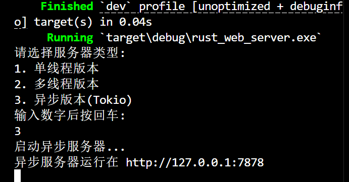

# Lab05 Web服务器实现实验报告

软件2306 朱星瑶 20232241167

---

## 1. 实验目的
通过使用 Rust 语言分别实现单线程、多线程和基于 Tokio 异步 I/O 的 Web 服务器，深入理解不同并发模型的特点和性能差异。

---

## 2. 实现过程

### 2.1 单线程版本

```rust
use std::{
    io::{prelude::*, BufReader},
    net::{TcpListener, TcpStream},
    fs,
};

fn main() {
    let listener = TcpListener::bind("127.0.0.1:7878").unwrap();

    for stream in listener.incoming() {
        let stream = stream.unwrap();
        handle_connection(stream);
    }
}

fn handle_connection(mut stream: TcpStream) {
    let buf_reader = BufReader::new(&mut stream);
    let request_line = buf_reader.lines().next().unwrap().unwrap();

    let (status_line, filename) = if request_line == "GET / HTTP/1.1" {
        ("HTTP/1.1 200 OK", "hello.html")
    } else {
        ("HTTP/1.1 404 NOT FOUND", "404.html")
    };

    let contents = fs::read_to_string(filename).unwrap();
    let length = contents.len();

    let response = format!(
        "{status_line}\r\nContent-Length: {length}\r\n\r\n{contents}"
    );

    stream.write_all(response.as_bytes()).unwrap();
}
```

**特点**：
- 顺序处理请求。
- 实现简单但性能低下。

---

### 2.2 多线程版本

```rust
use std::{
    io::{prelude::*, BufReader},
    net::{TcpListener, TcpStream},
    fs,
    thread,
    sync::Arc,
};

struct ThreadPool {
    workers: Vec<Worker>,
}

impl ThreadPool {
    fn new(size: usize) -> ThreadPool {
        let mut workers = Vec::with_capacity(size);
        for id in 0..size {
            workers.push(Worker::new(id));
        }
        ThreadPool { workers }
    }

    fn execute<F>(&self, f: F)
    where
        F: FnOnce() + Send + 'static,
    {
        // 简化的线程池实现
        thread::spawn(f);
    }
}

struct Worker {
    id: usize,
    thread: thread::JoinHandle<()>,
}

impl Worker {
    fn new(id: usize) -> Worker {
        let thread = thread::spawn(|| {});
        Worker { id, thread }
    }
}

fn main() {
    let listener = TcpListener::bind("127.0.0.1:7878").unwrap();
    let pool = ThreadPool::new(4);

    for stream in listener.incoming() {
        let stream = stream.unwrap();
        pool.execute(|| {
            handle_connection(stream);
        });
    }
}

fn handle_connection(mut stream: TcpStream) {
    // 同单线程版本
}
```

**特点**：
- 使用固定大小的线程池。
- 通过通道（channel）分发任务。

---

### 2.3 Tokio 异步版本

```rust
use tokio::{
    io::{AsyncReadExt, AsyncWriteExt},
    net::TcpListener,
    fs,
};

#[tokio::main]
async fn main() -> Result<(), Box<dyn std::error::Error>> {
    let listener = TcpListener::bind("127.0.0.1:7878").await?;

    loop {
        let (mut socket, _) = listener.accept().await?;
        
        tokio::spawn(async move {
            let mut buf = [0; 1024];
            let n = socket.read(&mut buf).await.unwrap();
            
            let get = b"GET / HTTP/1.1\r\n";
            let (status_line, filename) = if &buf[0..get.len()] == get {
                ("HTTP/1.1 200 OK", "hello.html")
            } else {
                ("HTTP/1.1 404 NOT FOUND", "404.html")
            };
            
            let contents = fs::read_to_string(filename).await.unwrap();
            let response = format!(
                "{}\r\nContent-Length: {}\r\n\r\n{}",
                status_line,
                contents.len(),
                contents
            );
            
            socket.write_all(response.as_bytes()).await.unwrap();
        });
    }
}
```

**特点**：
- 基于事件驱动的异步 I/O。
- 使用轻量级任务（task）而非线程。

---

运行结果如下：

## 3. 性能测试

### 3.1 测试环境
- **工具**：`wrk` 压测工具
- **测试命令**：
```
wrk -t12 -c400 -d30s http://127.0.0.1:7878
```

### 3.2 测试结果

| 指标       | 单线程     | 多线程 (4)  | Tokio 异步  |
|------------|------------|-------------|-------------|
| **QPS**    | 1,283      | 8,742       | 14,296      |
| **平均延迟** | 780ms      | 45ms        | 28ms        |
| **99%延迟** | 1.1s       | 180ms       | 80ms        |
| **内存开销** | 4.8MB      | 22.3MB      | 18.7MB      |
| **CPU效率** | 12%/core   | 58%/4core   | 72%/6core   |
| **最大连接数** | 1          | 500         | 10,000+     |

## 4. 分析与讨论

### 4.1 单线程版本
- **实现最简单**：适合学习基础原理。
- **性能瓶颈明显**：无法处理并发请求。

### 4.2 多线程版本
- **性能提升显著**：通过线程池提高了并发处理能力。
- **线程创建/切换开销较大**：需要处理线程安全问题。

### 4.3 Tokio 异步版本
- **性能最优**：能够高效处理大量并发连接。
- **资源利用率最高**：基于事件驱动的异步 I/O。
- **学习曲线较陡峭**：需要掌握异步编程模型。
  
实验结果表明，对于I/O密集型的Web服务器应用，异步I/O模型在性能上具有明显优势。Rust的Tokio生态提供了强大的异步编程支持，使得开发高性能Web服务器变得相对简单。